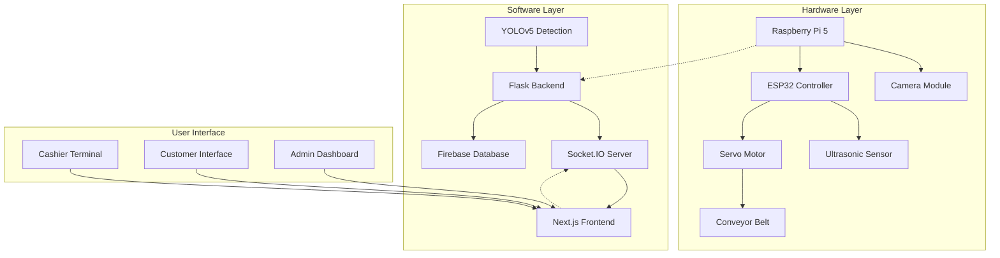

# 🛒 Self-Checkout System - YOLOv5 Powered

**Sistem Self-Checkout AI untuk Minimarket menggunakan YOLOv5**

> Proyek Skripsi - Carissa Nayaka Apta Padmasari  
> Program Studi Jaringan Telekomunikasi Digital  
> Politeknik Negeri Malang 2025

## 📋 Deskripsi

Sistem self-checkout berbasis AI yang memungkinkan pelanggan untuk melakukan transaksi secara mandiri menggunakan teknologi computer vision YOLOv5. Sistem ini mengatasi masalah barcode yang rusak atau sulit dipindai dengan mengenali produk secara otomatis melalui kamera.

## ✨ Fitur Utama

### 🔍 **AI Detection Engine**
- **Real-time object detection** menggunakan YOLOv5
- **Automatic product recognition** tanpa barcode
- **Configurable detection zones** untuk akurasi optimal
- **Multi-product support** dengan confidence scoring

### 🛒 **Smart Shopping Cart**
- **Auto-add products** saat terdeteksi di zona penghitungan
- **Real-time cart updates** via WebSocket
- **Manual item management** (hapus/edit)
- **Dynamic pricing calculation**

### 🎮 **Simulation Mode**
- **Virtual object testing** tanpa hardware fisik
- **Drag-and-drop interface** untuk pengujian
- **Zone movement controls** untuk validasi algoritma
- **Development-friendly testing**

### ⚙️ **Advanced Configuration**
- **Detection parameters**: threshold, zone positioning
- **Visual settings**: bounding boxes, labels, confidence
- **Performance tuning**: resolution, frame rate
- **Preset configurations**: retail, demo, debug modes

### 📱 **Modern Web Interface**
- **Responsive design** menggunakan Next.js + Tailwind CSS
- **Real-time updates** dengan Socket.IO
- **Intuitive controls** dengan Shadcn UI components
- **Mobile-friendly** interface

### 🏪 **Store Management**
- **Product CRUD operations** dengan dual storage
- **Transaction history** dengan analytics
- **QR code payments** untuk checkout
- **Firebase integration** untuk cloud storage

## 🏗️ Arsitektur Sistem



## 🛠️ Instalasi & Setup

### 📋 Prerequisites

**Untuk Development:**
- Node.js 18+ dan npm
- Python 3.8+
- Git

**Untuk Production (Raspberry Pi):**
- Raspberry Pi 4/5 dengan Raspberry Pi OS
- Camera module atau USB webcam
- ESP32 development board
- Servo motor dan ultrasonic sensor
- Conveyor belt setup

### 🚀 Quick Start (Development)

1. **Clone Repository**
```bash
git clone <repository-url>
cd self-checkout-system
```

2. **Install Dependencies**
```bash
# Frontend dependencies
npm install

# Backend dependencies
cd services
pip install -r requirements.txt
cd ..
```

3. **Environment Setup**
```bash
# Copy environment template
cp .env.example .env

# Edit configuration
nano .env
```

4. **Start Development Server**
```bash
# Start both frontend and backend
npm run dev

# Or start separately:
npm run dev:next    # Frontend only
npm run dev:python  # Backend only
```

5. **Access Application**
- Frontend: http://localhost:3000
- Backend API: http://localhost:5000
- Camera Feed: http://localhost:5000/video_feed

### 🔧 Konfigurasi Firebase (Opsional)

1. **Setup Firebase Project**
   - Buat project baru di [Firebase Console](https://console.firebase.google.com)
   - Enable Firestore Database
   - Generate service account key

2. **Download Credentials**
   ```bash
   # Simpan sebagai services/firebase-credentials.json
   ```

3. **Initialize Database**
   - Collection: `products` untuk master produk
   - Collection: `transactions` untuk riwayat transaksi

## 🏭 Production Deployment

### 📡 Deploy ke Raspberry Pi

1. **Prepare Raspberry Pi**
```bash
# Update system
sudo apt update && sudo apt upgrade -y

# Install required packages
sudo apt install -y python3-pip python3-venv nodejs npm git
```

2. **Use Deployment Script**
```bash
# Make script executable
chmod +x scripts/deploy-pi.sh

# Deploy to Raspberry Pi
./scripts/deploy-pi.sh 192.168.4.1 pi
```

3. **Manual Deployment Steps**
```bash
# Build application
npm run build

# Copy files to Pi
scp -r . pi@192.168.4.1:/home/pi/self-checkout-system/

# SSH into Pi and setup
ssh pi@192.168.4.1
cd self-checkout-system/services
python3 -m venv venv
source venv/bin/activate
pip install -r requirements.txt
```

### 🌐 WiFi Hotspot Setup

```bash
# Install hostapd and dnsmasq
sudo apt install -y hostapd dnsmasq

# Configure hotspot (automated in deploy script)
sudo systemctl enable hostapd dnsmasq
sudo systemctl start hostapd dnsmasq
```

**Hotspot Details:**
- SSID: `SelfCheckout-Store`
- Password: `selfcheckout123`
- Pi IP: `192.168.4.1`

### 🔧 Hardware Wiring

**ESP32 Connections:**
```
Ultrasonic Sensor:
- VCC → 5V
- GND → GND  
- Trig → GPIO 23
- Echo → GPIO 24

Servo Motor:
- VCC → 5V
- GND → GND
- Signal → GPIO 18
```

**Raspberry Pi Connections:**
```
Camera Module:
- CSI ribbon cable ke camera port

ESP32 Communication:
- TX → GPIO 14 (RX Pi)
- RX → GPIO 15 (TX Pi)
- GND → GND
```

## 📖 Panduan Penggunaan

### 👨‍💼 Untuk Kasir/Admin

1. **Akses Admin Panel**
   - Buka http://192.168.4.1:3000
   - Klik tombol "Products" untuk kelola produk
   - Klik "Configuration" untuk pengaturan sistem

2. **Kelola Produk**
   - Tambah produk baru dengan nama dan harga
   - Edit harga produk yang sudah ada
   - Hapus produk yang tidak diperlukan

3. **Monitoring Sistem**
   - Lihat status koneksi di header
   - Monitor detection feed secara real-time
   - Cek riwayat transaksi di menu "History"

### 🛒 Untuk Pelanggan

1. **Mulai Belanja**
   - Letakkan barang di atas conveyor belt
   - Sistem otomatis mendeteksi sensor ultrasonik
   - Conveyor akan bergerak membawa barang ke zona scanning

2. **Scanning Otomatis**
   - Kamera YOLOv5 akan mendeteksi produk
   - Barang otomatis ditambahkan ke keranjang
   - Lihat daftar belanja di sidebar kanan

3. **Checkout & Pembayaran**
   - Klik tombol "Checkout" setelah selesai
   - Scan QR code dengan aplikasi payment
   - Klik "Complete Payment" untuk selesai

### 🔧 Konfigurasi Sistem

**Detection Settings:**
- `Zone Start`: Posisi awal zona penghitungan (%)
- `Zone Width`: Lebar zona penghitungan (%)
- `Threshold`: Minimum confidence untuk deteksi
- `Auto Count`: Otomatis tambah ke keranjang

**Visual Settings:**
- `Show Boxes`: Tampilkan bounding box
- `Show Labels`: Tampilkan nama produk
- `Show Confidence`: Tampilkan skor confidence
- `Zone Opacity`: Transparansi zona deteksi

**Advanced Settings:**
- `Resolution`: Resolusi kamera (640x480, 1280x720, 1920x1080)
- `Frame Rate`: FPS untuk processing (10-60)
- `Processing Speed`: Balance antara speed vs accuracy

## 🎮 Mode Simulasi

Untuk testing tanpa hardware fisik:

1. **Aktifkan Simulation Mode**
   - Toggle switch "Simulation Mode" di scanner view
   - Tombol "Simulation Control" akan muncul

2. **Tambah Virtual Objects**
   - Pilih jenis produk dari dropdown
   - Set posisi X, Y dan ukuran
   - Klik "Add Virtual Object"

3. **Control Object Movement**
   - Gunakan tombol arrow untuk gerakkan objek
   - Klik "Zone" untuk pindah ke zona deteksi
   - Delete objek yang tidak diperlukan

## 🧪 Testing & Development

### 🔍 Unit Tests
```bash
# Run frontend tests
npm test

# Run backend tests  
cd services
python -m pytest tests/
```

### 📊 Performance Monitoring
```bash
# Check system resources
htop

# Monitor GPU usage (if available)
nvidia-smi

# Check camera feed latency
curl -w "@curl-format.txt" http://localhost:5000/video_feed
```

### 🐛 Debugging

**Common Issues:**

1. **Kamera tidak terdeteksi**
```bash
# Check camera devices
ls /dev/video*

# Test camera
ffmpeg -f v4l2 -list_formats all -i /dev/video0
```

2. **Model YOLO tidak load**
```bash
# Download model manually
cd services
wget https://github.com/ultralytics/yolov5/releases/download/v6.0/yolov5s.pt
```

3. **Socket connection error**
```bash
# Check port availability
netstat -tlnp | grep 5000

# Restart services
sudo systemctl restart self-checkout-backend
```

## 📊 System Metrics

**Performance Benchmarks (Raspberry Pi 4):**
- Detection latency: ~200ms per frame
- Socket.IO response: <50ms
- Camera feed: 15-30 FPS
- Memory usage: ~1.5GB
- CPU usage: 60-80% during detection

**Supported Products:**
- 5 produk utama (sesuai batasan penelitian)
- Expandable hingga 50+ produk
- Custom training dataset support

## 🤝 Contributing

1. Fork repository
2. Create feature branch (`git checkout -b feature/amazing-feature`)
3. Commit changes (`git commit -m 'Add amazing feature'`)
4. Push to branch (`git push origin feature/amazing-feature`)
5. Open Pull Request

## 📄 License

Distributed under the MIT License. See `LICENSE` for more information.

## 👨‍🎓 Penelitian & Publikasi

**Peneliti:** Carissa Nayaka Apta Padmasari  
**Pembimbing:** 
- Ibu Rieke Adriati Wijayanti, S.T., M.T.
- Ibu Atik Novianti, S.ST., M.T.

**Institusi:** Politeknik Negeri Malang  
**Program Studi:** D4 Jaringan Telekomunikasi Digital  
**Tahun:** 2025

## 🔗 Links & Resources

- [YOLOv5 Documentation](https://docs.ultralytics.com/yolov5/)
- [Next.js Documentation](https://nextjs.org/docs)
- [Raspberry Pi Setup Guide](https://www.raspberrypi.org/documentation/)
- [Firebase Documentation](https://firebase.google.com/docs)

## 📞 Support

Untuk pertanyaan teknis atau dukungan:
- Email: carissa.nayaka@student.polinema.ac.id
- GitHub Issues: [Create Issue](../../issues)
- Documentation: [Wiki Pages](../../wiki)

---

**🎯 "Revolutionizing retail with AI-powered self-checkout technology"**